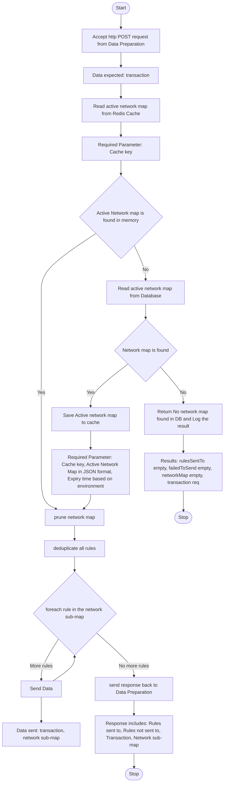

# Channel Routing \& Setup Processor (CRSP)

<div align="center">

</div>

An overview of the processor is detailed [here](https://github.com/frmscoe/docs/blob/main/Product/channel-router-and-setup-processor.md)

  - [Sequence Diagram](#sequence-diagram)
  - [Code Activity Diagram](#code-activity-diagram)
  - [Usage](#usage)
  - [Sample JSON Request \& Response](#sample-json-request--response)
    - [Request for Pain001](#request-for-pain001)
    - [Response for Pain001](#response-for-pain001)
    - [Request for Pain013](#request-for-pain013)
    - [Response for Pain013](#response-for-pain013)
    - [Request for Pacs002](#request-for-pacs002)
    - [Response for Pacs002](#response-for-pacs002)
    - [Request for Pacs008](#request-for-pacs008)
    - [Response for Pacs008](#response-for-pacs008)
  - [Troubleshooting](#troubleshooting)

## Setting Up

### Dependencies

- [ArangoDB](https://arangodb.com/)
  You need to have an active network map. Refer to the [aforementioned](https://github.com/frmscoe/docs/blob/main/Product/channel-router-and-setup-processor.md) documentation
- [NATS](https://nats.io)
  This is what the processors mainly use for communication
- [Redis](https://redis.io/)
  For caching

You also need NodeJS to be installed in your system. The current LTS (https://nodejs.org/en) should be suitable. Please open an issue if the application fails to build on the current LTS version. Unix platforms, you should be able to find `nodejs` in your package manager's repositories.

### Clone the repository:

```sh
git clone https://github.com/frmscoe/channel-router-setup-processor
```

### Install dependencies

```sh
cd channel-router-setup-processor
npm i
```

### Configure environment

| Variable | Purpose | Example
| ------ | ------ | ------ |
| `FUNCTION_NAME` | Denotes the type of application that is running. This is also used in logs to show the source of logs | `CRSP`
| `NODE_ENV` | Represents the environment the application is currently running in | `dev`
| `CACHETTL` | Duration in milliseconds until a cache key is expired |`5000`
| `MAX_CPU` | Max number of CPUs to use | `1`
| `APM_ACTIVE` | Enable Application Performance Monitoring through Elastic | `false`
| `REDIS_DB` | Redis database | `0`
| `REDIS_AUTH` | [Redis] password | `01ARZ3Example`
| `REDIS_SERVERS` | [Redis] Host in `json` format | `[{"host":"redis", "port":6379}]`
| `REDIS_IS_CLUSTER` | A flag to indicate if [Redis] is served in cluster mode | `false`
| `SERVER_URL` | A URL where [NATS] is served | `nats:4222`
| `STARTUP_TYPE` | Configure [NATS] NATS features | `nats`
| `CONSUMER_STREAM` | The [NATS] subject that this application listens on | `CRSP`
| `PRODUCER_STREAM` | The [NATS] subject(s) that this application sends messages to | `Rule901`
| `ACK_POLICY` | [NATS] Ack policy | `Explicit`
| `PRODUCER_STORAGE` | [NATS] Producer Storage | `File`
| `PRODUCER_RETENTION_POLICY` | [NATS] Producer Retention Policy | `Workqueue`
| `DATABASE_URL` | URL where [Arango] is served | `tcp://arango:8529`
| `DATABASE_USER` | [Arango] database username | `root`
| `DATABASE_PASSWORD` | [Arango] database password | `password`
| `DATABASE_NAME` | [Arango] database name | `networkmap`
| `CONFIG_DATABASE` | [Arango] Configuration name | `Configuration`

## Sequence Diagram

Below is the sequence diagram for CRSP


The Channel Router & Setup Processor (CRSP) is where most of the heavy lifting happens. The CRSP is responsible for branching the transaction to all the different rules in the different channels. It uses the Network Map as configuration source, de-duplicates all the rules, generates a network submap (that is sent to Rule Processors), allowing the Rule Processors to know to which Typologies they need to send their results.


## Code Activity Diagram




## Sample JSON Request & Response

``POST request to `/execute endpoint``
As the processor listens on a NATS subject, the message it receives is deserialised into an object matching the following structures

### Request for Pain001

```json
{
"TxTp": "pain.001.001.11",
    "CstmrCdtTrfInitn": {
      "GrpHdr": {
        "MsgId": "2669e349-500d-44ba-9e27-7767a16608a0",
        "CreDtTm": "2021-10-07T09:25:31.000Z",
        "NbOfTxs": 1,
        "InitgPty": {
          "Nm": "Ivan Reese Russel-Klein",
          "Id": {
            "PrvtId": {
              "DtAndPlcOfBirth": {
                "BirthDt": "1967-11-23",
                "CityOfBirth": "Unknown",
                "CtryOfBirth": "ZZ"
              },
              "Othr": {
                "Id": "+27783078685",
                "SchmeNm": {
                  "Prtry": "MSISDN"
                }
              }
            }
          },
          "CtctDtls": {
            "MobNb": "+27-783078685"
          }
        }
      },
      "PmtInf": {
        "PmtInfId": "b51ec534-ee48-4575-b6a9-ead2955b8069",
        "PmtMtd": "TRA",
        "ReqdAdvcTp": {
          "DbtAdvc": {
            "Cd": "ADWD",
            "Prtry": "Advice with transaction details"
          }
        },
        "ReqdExctnDt": {
          "Dt": "2021-10-07",
          "DtTm": "2021-10-07T09:25:31.000Z"
        },
        "Dbtr": {
          "Nm": "Ivan Reese Russel-Klein",
          "Id": {
            "PrvtId": {
              "DtAndPlcOfBirth": {
                "BirthDt": "1957-10-05",
                "CityOfBirth": "Unknown",
                "CtryOfBirth": "ZZ"
              },
              "Othr": {
                "Id": "+27783078685",
                "SchmeNm": {
                  "Prtry": "MSISDN"
                }
              }
            }
          },
          "CtctDtls": {
            "MobNb": "+27-783078685"
          }
        },
        "DbtrAcct": {
          "Id": {
            "Othr": {
              "Id": "+27783078685",
              "SchmeNm": {
                "Prtry": "PASSPORT"
              }
            }
          },
          "Nm": "Ivan Russel-Klein"
        },
        "DbtrAgt": {
          "FinInstnId": {
            "ClrSysMmbId": {
              "MmbId": "dfsp001"
            }
          }
        },
        "CdtTrfTxInf": {
          "PmtId": {
            "EndToEndId": "b51ec534-ee48-4575-b6a9-ead2955b8069"
          },
          "PmtTpInf": {
            "CtgyPurp": {
              "Prtry": "TRANSFER"
            }
          },
          "Amt": {
            "InstdAmt": {
              "Amt": {
                "Amt": "50431891779910900",
                "Ccy": "USD"
              }
            },
            "EqvtAmt": {
              "Amt": {
                "Amt": "50431891779910900",
                "Ccy": "USD"
              },
              "CcyOfTrf": "USD"
            }
          },
          "ChrgBr": "DEBT",
          "CdtrAgt": {
            "FinInstnId": {
              "ClrSysMmbId": {
                "MmbId": "dfsp002"
              }
            }
          },
          "Cdtr": {
            "Nm": "April Sam Adamson",
            "Id": {
              "PrvtId": {
                "DtAndPlcOfBirth": {
                  "BirthDt": "1923-04-26",
                  "CityOfBirth": "Unknown",
                  "CtryOfBirth": "ZZ"
                },
                "Othr": {
                  "Id": "+27782722305",
                  "SchmeNm": {
                    "Prtry": "MSISDN"
                  }
                }
              }
            },
            "CtctDtls": {
              "MobNb": "+27-782722305"
            }
          },
          "CdtrAcct": {
            "Id": {
              "Othr": {
                "Id": "+27783078685",
                "SchmeNm": {
                  "Prtry": "MSISDN"
                }
              }
            },
            "Nm": "April Adamson"
          },
          "Purp": {
            "Cd": "MP2P"
          },
          "RgltryRptg": {
            "Dtls": {
              "Tp": "BALANCE OF PAYMENTS",
              "Cd": "100"
            }
          },
          "RmtInf": {
            "Ustrd": "Payment of USD 49932566118723700.89 from Ivan to April"
          },
          "SplmtryData": {
            "Envlp": {
              "Doc": {
                "Cdtr": {
                  "FrstNm": "Ivan",
                  "MddlNm": "Reese",
                  "LastNm": "Russel-Klein",
                  "MrchntClssfctnCd": "BLANK"
                },
                "Dbtr": {
                  "FrstNm": "April",
                  "MddlNm": "Sam",
                  "LastNm": "Adamson",
                  "MrchntClssfctnCd": "BLANK"
                },
                "DbtrFinSvcsPrvdrFees": {
                  "Ccy": "USD",
                  "Amt": "499325661187237"
                },
                "Xprtn": "2021-10-07T09:30:31.000Z"
              }
            }
          }
        }
      },
      "SplmtryData": {
        "Envlp": {
          "Doc": {
            "InitgPty": {
              "InitrTp": "CONSUMER",
              "Glctn": {
                "Lat": "-3.1291",
                "Long": "39.0006"
              }
            }
          }
        }
      }
    }
}
```

### Response for Pain001

```json
{
    "rulesSentTo": [
        "028@1.0",
        "003@1.0"
    ],
    "failedToSend": [
        "005@1.0",
        "006@1.0",
        "007@1.0"
    ],
    "transaction": {
        "TxTp": "pain.001.001.11",
        "CstmrCdtTrfInitn": {
            "GrpHdr": {
                "MsgId": "2669e349-500d-44ba-9e27-7767a16608a0",
                "CreDtTm": "2021-10-07T09:25:31.000Z",
                "NbOfTxs": 1,
                "InitgPty": {
                    "Nm": "Ivan Reese Russel-Klein",
                    "Id": {
                        "PrvtId": {
                            "DtAndPlcOfBirth": {
                                "BirthDt": "1967-11-23",
                                "CityOfBirth": "Unknown",
                                "CtryOfBirth": "ZZ"
                            },
                            "Othr": {
                                "Id": "+27783078685",
                                "SchmeNm": {
                                    "Prtry": "MSISDN"
                                }
                            }
                        }
                    },
                    "CtctDtls": {
                        "MobNb": "+27-783078685"
                    }
                }
            },
            "PmtInf": {
                "PmtInfId": "b51ec534-ee48-4575-b6a9-ead2955b8069",
                "PmtMtd": "TRA",
                "ReqdAdvcTp": {
                    "DbtAdvc": {
                        "Cd": "ADWD",
                        "Prtry": "Advice with transaction details"
                    }
                },
                "ReqdExctnDt": {
                    "Dt": "2021-10-07",
                    "DtTm": "2021-10-07T09:25:31.000Z"
                },
                "Dbtr": {
                    "Nm": "Ivan Reese Russel-Klein",
                    "Id": {
                        "PrvtId": {
                            "DtAndPlcOfBirth": {
                                "BirthDt": "1957-10-05",
                                "CityOfBirth": "Unknown",
                                "CtryOfBirth": "ZZ"
                            },
                            "Othr": {
                                "Id": "+27783078685",
                                "SchmeNm": {
                                    "Prtry": "MSISDN"
                                }
                            }
                        }
                    },
                    "CtctDtls": {
                        "MobNb": "+27-783078685"
                    }
                },
                "DbtrAcct": {
                    "Id": {
                        "Othr": {
                            "Id": "+27783078685",
                            "SchmeNm": {
                                "Prtry": "PASSPORT"
                            }
                        }
                    },
                    "Nm": "Ivan Russel-Klein"
                },
                "DbtrAgt": {
                    "FinInstnId": {
                        "ClrSysMmbId": {
                            "MmbId": "dfsp001"
                        }
                    }
                },
                "CdtTrfTxInf": {
                    "PmtId": {
                        "EndToEndId": "b51ec534-ee48-4575-b6a9-ead2955b8069"
                    },
                    "PmtTpInf": {
                        "CtgyPurp": {
                            "Prtry": "TRANSFER"
                        }
                    },
                    "Amt": {
                        "InstdAmt": {
                            "Amt": {
                                "Amt": "50431891779910900",
                                "Ccy": "USD"
                            }
                        },
                        "EqvtAmt": {
                            "Amt": {
                                "Amt": "50431891779910900",
                                "Ccy": "USD"
                            },
                            "CcyOfTrf": "USD"
                        }
                    },
                    "ChrgBr": "DEBT",
                    "CdtrAgt": {
                        "FinInstnId": {
                            "ClrSysMmbId": {
                                "MmbId": "dfsp002"
                            }
                        }
                    },
                    "Cdtr": {
                        "Nm": "April Sam Adamson",
                        "Id": {
                            "PrvtId": {
                                "DtAndPlcOfBirth": {
                                    "BirthDt": "1923-04-26",
                                    "CityOfBirth": "Unknown",
                                    "CtryOfBirth": "ZZ"
                                },
                                "Othr": {
                                    "Id": "+27782722305",
                                    "SchmeNm": {
                                        "Prtry": "MSISDN"
                                    }
                                }
                            }
                        },
                        "CtctDtls": {
                            "MobNb": "+27-782722305"
                        }
                    },
                    "CdtrAcct": {
                        "Id": {
                            "Othr": {
                                "Id": "+27783078685",
                                "SchmeNm": {
                                    "Prtry": "MSISDN"
                                }
                            }
                        },
                        "Nm": "April Adamson"
                    },
                    "Purp": {
                        "Cd": "MP2P"
                    },
                    "RgltryRptg": {
                        "Dtls": {
                            "Tp": "BALANCE OF PAYMENTS",
                            "Cd": "100"
                        }
                    },
                    "RmtInf": {
                        "Ustrd": "Payment of USD 49932566118723700.89 from Ivan to April"
                    },
                    "SplmtryData": {
                        "Envlp": {
                            "Doc": {
                                "Cdtr": {
                                    "FrstNm": "Ivan",
                                    "MddlNm": "Reese",
                                    "LastNm": "Russel-Klein",
                                    "MrchntClssfctnCd": "BLANK"
                                },
                                "Dbtr": {
                                    "FrstNm": "April",
                                    "MddlNm": "Sam",
                                    "LastNm": "Adamson",
                                    "MrchntClssfctnCd": "BLANK"
                                },
                                "DbtrFinSvcsPrvdrFees": {
                                    "Ccy": "USD",
                                    "Amt": "499325661187237"
                                },
                                "Xprtn": "2021-10-07T09:30:31.000Z"
                            }
                        }
                    }
                }
            },
            "SplmtryData": {
                "Envlp": {
                    "Doc": {
                        "InitgPty": {
                            "InitrTp": "CONSUMER",
                            "Glctn": {
                                "Lat": "-3.1291",
                                "Long": "39.0006"
                            }
                        }
                    }
                }
            }
        }
    },
    "networkMap": {
        "messages": [
            {
                "id": "001@1.0",
                "host": "http://openfaas:8080",
                "cfg": "1.0",
                "txTp": "pain.001.001.11",
                "channels": [
                    {
                        "id": "001@1.0",
                        "host": "http://openfaas:8080",
                        "cfg": "1.0",
                        "typologies": [
                            {
                                "id": "028@1.0",
                                "host": "https://frmfaas.sybrin.com/function/off-typology-processor",
                                "cfg": "028@1.0",
                                "rules": [
                                    {
                                        "id": "003@1.0",
                                        "host": "https://frmfaas.sybrin.com/function/off-rule-003",
                                        "cfg": "1.0"
                                    },
                                    {
                                        "id": "028@1.0",
                                        "host": "https://frmfaas.sybrin.com/function/off-rule-028",
                                        "cfg": "1.0"
                                    }
                                ]
                            },
                            {
                                "id": "029@1.0",
                                "host": "https://frmfaas.sybrin.com/function/off-typology-processor",
                                "cfg": "029@1.0",
                                "rules": [
                                    {
                                        "id": "003@1.0",
                                        "host": "https://frmfaas.sybrin.com/function/off-rule-003",
                                        "cfg": "1.0"
                                    },
                                    {
                                        "id": "005@1.0",
                                        "host": "http://openfaas:8080",
                                        "cfg": "1.0"
                                    }
                                ]
                            }
                        ]
                    },
                    {
                        "id": "002@1.0",
                        "host": "http://openfaas:8080",
                        "cfg": "1.0",
                        "typologies": [
                            {
                                "id": "030@1.0",
                                "host": "https://frmfaas.sybrin.com/function/off-typology-processor",
                                "cfg": "030@1.0",
                                "rules": [
                                    {
                                        "id": "003@1.0",
                                        "host": "https://frmfaas.sybrin.com/function/off-rule-003",
                                        "cfg": "1.0"
                                    },
                                    {
                                        "id": "006@1.0",
                                        "host": "http://openfaas:8080",
                                        "cfg": "1.0"
                                    }
                                ]
                            },
                            {
                                "id": "031@1.0",
                                "host": "https://frmfaas.sybrin.com/function/off-typology-processor",
                                "cfg": "031@1.0",
                                "rules": [
                                    {
                                        "id": "003@1.0",
                                        "host": "https://frmfaas.sybrin.com/function/off-rule-003",
                                        "cfg": "1.0"
                                    },
                                    {
                                        "id": "007@1.0",
                                        "host": "http://openfaas:8080",
                                        "cfg": "1.0"
                                    }
                                ]
                            }
                        ]
                    }
                ]
            }
        ]
    }
}
```

### Request for Pain013

```json
{
"TxTp": "pain.013.001.09",
    "CstmrCdtTrfInitn": {
      "GrpHdr": {
        "MsgId": "2669e349-500d-44ba-9e27-7767a16608a0",
        "CreDtTm": "2021-10-07T09:25:31.000Z",
        "NbOfTxs": 1,
        "InitgPty": {
          "Nm": "Ivan Reese Russel-Klein",
          "Id": {
            "PrvtId": {
              "DtAndPlcOfBirth": {
                "BirthDt": "1967-11-23",
                "CityOfBirth": "Unknown",
                "CtryOfBirth": "ZZ"
              },
              "Othr": {
                "Id": "+27783078685",
                "SchmeNm": {
                  "Prtry": "MSISDN"
                }
              }
            }
          },
          "CtctDtls": {
            "MobNb": "+27-783078685"
          }
        }
      },
      "PmtInf": {
        "PmtInfId": "b51ec534-ee48-4575-b6a9-ead2955b8069",
        "PmtMtd": "TRA",
        "ReqdAdvcTp": {
          "DbtAdvc": {
            "Cd": "ADWD",
            "Prtry": "Advice with transaction details"
          }
        },
        "ReqdExctnDt": {
          "Dt": "2021-10-07",
          "DtTm": "2021-10-07T09:25:31.000Z"
        },
        "Dbtr": {
          "Nm": "Ivan Reese Russel-Klein",
          "Id": {
            "PrvtId": {
              "DtAndPlcOfBirth": {
                "BirthDt": "1957-10-05",
                "CityOfBirth": "Unknown",
                "CtryOfBirth": "ZZ"
              },
              "Othr": {
                "Id": "+27783078685",
                "SchmeNm": {
                  "Prtry": "MSISDN"
                }
              }
            }
          },
          "CtctDtls": {
            "MobNb": "+27-783078685"
          }
        },
        "DbtrAcct": {
          "Id": {
            "Othr": {
              "Id": "+27783078685",
              "SchmeNm": {
                "Prtry": "PASSPORT"
              }
            }
          },
          "Nm": "Ivan Russel-Klein"
        },
        "DbtrAgt": {
          "FinInstnId": {
            "ClrSysMmbId": {
              "MmbId": "dfsp001"
            }
          }
        },
        "CdtTrfTxInf": {
          "PmtId": {
            "EndToEndId": "b51ec534-ee48-4575-b6a9-ead2955b8069"
          },
          "PmtTpInf": {
            "CtgyPurp": {
              "Prtry": "TRANSFER"
            }
          },
          "Amt": {
            "InstdAmt": {
              "Amt": {
                "Amt": "50431891779910900",
                "Ccy": "USD"
              }
            },
            "EqvtAmt": {
              "Amt": {
                "Amt": "50431891779910900",
                "Ccy": "USD"
              },
              "CcyOfTrf": "USD"
            }
          },
          "ChrgBr": "DEBT",
          "CdtrAgt": {
            "FinInstnId": {
              "ClrSysMmbId": {
                "MmbId": "dfsp002"
              }
            }
          },
          "Cdtr": {
            "Nm": "April Sam Adamson",
            "Id": {
              "PrvtId": {
                "DtAndPlcOfBirth": {
                  "BirthDt": "1923-04-26",
                  "CityOfBirth": "Unknown",
                  "CtryOfBirth": "ZZ"
                },
                "Othr": {
                  "Id": "+27782722305",
                  "SchmeNm": {
                    "Prtry": "MSISDN"
                  }
                }
              }
            },
            "CtctDtls": {
              "MobNb": "+27-782722305"
            }
          },
          "CdtrAcct": {
            "Id": {
              "Othr": {
                "Id": "+27783078685",
                "SchmeNm": {
                  "Prtry": "MSISDN"
                }
              }
            },
            "Nm": "April Adamson"
          },
          "Purp": {
            "Cd": "MP2P"
          },
          "RgltryRptg": {
            "Dtls": {
              "Tp": "BALANCE OF PAYMENTS",
              "Cd": "100"
            }
          },
          "RmtInf": {
            "Ustrd": "Payment of USD 49932566118723700.89 from Ivan to April"
          },
          "SplmtryData": {
            "Envlp": {
              "Doc": {
                "Cdtr": {
                  "FrstNm": "Ivan",
                  "MddlNm": "Reese",
                  "LastNm": "Russel-Klein",
                  "MrchntClssfctnCd": "BLANK"
                },
                "Dbtr": {
                  "FrstNm": "April",
                  "MddlNm": "Sam",
                  "LastNm": "Adamson",
                  "MrchntClssfctnCd": "BLANK"
                },
                "DbtrFinSvcsPrvdrFees": {
                  "Ccy": "USD",
                  "Amt": "499325661187237"
                },
                "Xprtn": "2021-10-07T09:30:31.000Z"
              }
            }
          }
        }
      },
      "SplmtryData": {
        "Envlp": {
          "Doc": {
            "InitgPty": {
              "InitrTp": "CONSUMER",
              "Glctn": {
                "Lat": "-3.1291",
                "Long": "39.0006"
              }
            }
          }
        }
      }
    }
}
```

### Response for Pain013

```json
{
    "rulesSentTo": [
        "003@1.0",
        "028@1.0"
    ],
    "failedToSend": [],
    "networkMap": {},
    "transaction": {
        "TxTp": "pain.013.001.09",
        "CstmrCdtTrfInitn": {
            "GrpHdr": {
                "MsgId": "2669e349-500d-44ba-9e27-7767a16608a0",
                "CreDtTm": "2021-10-07T09:25:31.000Z",
                "NbOfTxs": 1,
                "InitgPty": {
                    "Nm": "Ivan Reese Russel-Klein",
                    "Id": {
                        "PrvtId": {
                            "DtAndPlcOfBirth": {
                                "BirthDt": "1967-11-23",
                                "CityOfBirth": "Unknown",
                                "CtryOfBirth": "ZZ"
                            },
                            "Othr": {
                                "Id": "+27783078685",
                                "SchmeNm": {
                                    "Prtry": "MSISDN"
                                }
                            }
                        }
                    },
                    "CtctDtls": {
                        "MobNb": "+27-783078685"
                    }
                }
            },
            "PmtInf": {
                "PmtInfId": "b51ec534-ee48-4575-b6a9-ead2955b8069",
                "PmtMtd": "TRA",
                "ReqdAdvcTp": {
                    "DbtAdvc": {
                        "Cd": "ADWD",
                        "Prtry": "Advice with transaction details"
                    }
                },
                "ReqdExctnDt": {
                    "Dt": "2021-10-07",
                    "DtTm": "2021-10-07T09:25:31.000Z"
                },
                "Dbtr": {
                    "Nm": "Ivan Reese Russel-Klein",
                    "Id": {
                        "PrvtId": {
                            "DtAndPlcOfBirth": {
                                "BirthDt": "1957-10-05",
                                "CityOfBirth": "Unknown",
                                "CtryOfBirth": "ZZ"
                            },
                            "Othr": {
                                "Id": "+27783078685",
                                "SchmeNm": {
                                    "Prtry": "MSISDN"
                                }
                            }
                        }
                    },
                    "CtctDtls": {
                        "MobNb": "+27-783078685"
                    }
                },
                "DbtrAcct": {
                    "Id": {
                        "Othr": {
                            "Id": "+27783078685",
                            "SchmeNm": {
                                "Prtry": "PASSPORT"
                            }
                        }
                    },
                    "Nm": "Ivan Russel-Klein"
                },
                "DbtrAgt": {
                    "FinInstnId": {
                        "ClrSysMmbId": {
                            "MmbId": "dfsp001"
                        }
                    }
                },
                "CdtTrfTxInf": {
                    "PmtId": {
                        "EndToEndId": "b51ec534-ee48-4575-b6a9-ead2955b8069"
                    },
                    "PmtTpInf": {
                        "CtgyPurp": {
                            "Prtry": "TRANSFER"
                        }
                    },
                    "Amt": {
                        "InstdAmt": {
                            "Amt": {
                                "Amt": "50431891779910900",
                                "Ccy": "USD"
                            }
                        },
                        "EqvtAmt": {
                            "Amt": {
                                "Amt": "50431891779910900",
                                "Ccy": "USD"
                            },
                            "CcyOfTrf": "USD"
                        }
                    },
                    "ChrgBr": "DEBT",
                    "CdtrAgt": {
                        "FinInstnId": {
                            "ClrSysMmbId": {
                                "MmbId": "dfsp002"
                            }
                        }
                    },
                    "Cdtr": {
                        "Nm": "April Sam Adamson",
                        "Id": {
                            "PrvtId": {
                                "DtAndPlcOfBirth": {
                                    "BirthDt": "1923-04-26",
                                    "CityOfBirth": "Unknown",
                                    "CtryOfBirth": "ZZ"
                                },
                                "Othr": {
                                    "Id": "+27782722305",
                                    "SchmeNm": {
                                        "Prtry": "MSISDN"
                                    }
                                }
                            }
                        },
                        "CtctDtls": {
                            "MobNb": "+27-782722305"
                        }
                    },
                    "CdtrAcct": {
                        "Id": {
                            "Othr": {
                                "Id": "+27783078685",
                                "SchmeNm": {
                                    "Prtry": "MSISDN"
                                }
                            }
                        },
                        "Nm": "April Adamson"
                    },
                    "Purp": {
                        "Cd": "MP2P"
                    },
                    "RgltryRptg": {
                        "Dtls": {
                            "Tp": "BALANCE OF PAYMENTS",
                            "Cd": "100"
                        }
                    },
                    "RmtInf": {
                        "Ustrd": "Payment of USD 49932566118723700.89 from Ivan to April"
                    },
                    "SplmtryData": {
                        "Envlp": {
                            "Doc": {
                                "Cdtr": {
                                    "FrstNm": "Ivan",
                                    "MddlNm": "Reese",
                                    "LastNm": "Russel-Klein",
                                    "MrchntClssfctnCd": "BLANK"
                                },
                                "Dbtr": {
                                    "FrstNm": "April",
                                    "MddlNm": "Sam",
                                    "LastNm": "Adamson",
                                    "MrchntClssfctnCd": "BLANK"
                                },
                                "DbtrFinSvcsPrvdrFees": {
                                    "Ccy": "USD",
                                    "Amt": "499325661187237"
                                },
                                "Xprtn": "2021-10-07T09:30:31.000Z"
                            }
                        }
                    }
                }
            },
            "SplmtryData": {
                "Envlp": {
                    "Doc": {
                        "InitgPty": {
                            "InitrTp": "CONSUMER",
                            "Glctn": {
                                "Lat": "-3.1291",
                                "Long": "39.0006"
                            }
                        }
                    }
                }
            }
        }
    }
}
```

### Request for Pacs002


```json
{
  "transaction": {
    "TxTp": "pacs.002.001.12",
    "FIToFIPmtSts": {
      "GrpHdr": {
        "MsgId": "43c0e3bd11164fef87a427ec559a9e92",
        "CreDtTm": "2020-05-08T12:38:28.812Z"
      },
      "TxInfAndSts": {
        "OrgnlInstrId": "5ab4fc7355de4ef8a75b78b00a681ed2",
        "OrgnlEndToEndId": "3bc4ea02daea4b7fb354d44211561150",
        "TxSts": "ACCC",
        "ChrgsInf": [
          {
            "Amt": {
              "Amt": 0,
              "Ccy": "USD"
            },
            "Agt": {
              "FinInstnId": {
                "ClrSysMmbId": {
                  "MmbId": "dfsp001"
                }
              }
            }
          },
          {
            "Amt": {
              "Amt": 0,
              "Ccy": "USD"
            },
            "Agt": {
              "FinInstnId": {
                "ClrSysMmbId": {
                  "MmbId": "dfsp001"
                }
              }
            }
          },
          {
            "Amt": {
              "Amt": 0,
              "Ccy": "USD"
            },
            "Agt": {
              "FinInstnId": {
                "ClrSysMmbId": {
                  "MmbId": "dfsp002"
                }
              }
            }
          }
        ],
        "AccptncDtTm": "2023-06-02T07:52:31.000Z",
        "InstgAgt": {
          "FinInstnId": {
            "ClrSysMmbId": {
              "MmbId": "dfsp001"
            }
          }
        },
        "InstdAgt": {
          "FinInstnId": {
            "ClrSysMmbId": {
              "MmbId": "dfsp002"
            }
          }
        }
      }
    }
  },
  "DataCache": {
    "dbtrId": "dbtrId",
    "cdtrId": "cdtrId",
    "cdtrAcctId": "cdtrAcct_abc",
    "dbtrAcctId": "dbtrAcct_def",
    "amt": {
      "amt": 422.25,
      "ccy": "XTS"
    },
    "creDtTm": "2020-05-08T12:33:28.812Z"
  }
}
```

### Response for Pacs002

```json
{
  "transaction": {
    "TxTp": "pacs.002.001.12",
    "FIToFIPmtSts": {
      "GrpHdr": {
        "MsgId": "5a22641e90ca47fab8a3f23663a64e56",
        "CreDtTm": "2024-05-08T12:34:17.889Z"
      },
      "TxInfAndSts": {
        "OrgnlInstrId": "5ab4fc7355de4ef8a75b78b00a681ed2",
        "OrgnlEndToEndId": "d8e1734cee4f4ccaabf0d22d0d91dbda",
        "TxSts": "ACCC",
        "ChrgsInf": [
          {
            "Amt": {
              "Amt": 0,
              "Ccy": "USD"
            },
            "Agt": {
              "FinInstnId": {
                "ClrSysMmbId": {
                  "MmbId": "dfsp001"
                }
              }
            }
          },
          {
            "Amt": {
              "Amt": 0,
              "Ccy": "USD"
            },
            "Agt": {
              "FinInstnId": {
                "ClrSysMmbId": {
                  "MmbId": "dfsp001"
                }
              }
            }
          },
          {
            "Amt": {
              "Amt": 0,
              "Ccy": "USD"
            },
            "Agt": {
              "FinInstnId": {
                "ClrSysMmbId": {
                  "MmbId": "dfsp002"
                }
              }
            }
          }
        ],
        "AccptncDtTm": "2023-06-02T07:52:31.000Z",
        "InstgAgt": {
          "FinInstnId": {
            "ClrSysMmbId": {
              "MmbId": "dfsp001"
            }
          }
        },
        "InstdAgt": {
          "FinInstnId": {
            "ClrSysMmbId": {
              "MmbId": "dfsp002"
            }
          }
        }
      }
    }
  },
  "networkMap": {
    "active": true,
    "cfg": "1.0.0",
    "messages": [
      {
        "id": "004@1.0.0",
        "cfg": "1.0.0",
        "txTp": "pacs.002.001.12",
        "typologies": [
          {
            "id": "typology-processor@1.0.0",
            "cfg": "999@1.0.0",
            "rules": [
              {
                "id": "901@1.0.0",
                "cfg": "1.0.0"
              }
            ]
          }
        ]
      }
    ]
  },
  "DataCache": {
    "dbtrId": "dbtrId",
    "cdtrId": "cdtrId",
    "cdtrAcctId": "cdtrAcct_abc",
    "dbtrAcctId": "dbtrAcct_def",
    "amt": {
      "amt": 615.44,
      "ccy": "XTS"
    },
    "creDtTm": "2020-05-08T12:29:17.889Z"
  },
  "metaData": {
    "prcgTmCRSP": 1,
    "traceParent": null
  }
}
```

### Request for Pacs008

```json
{
"TxTp": "pacs.008.001.10",
    "CstmrCdtTrfInitn": {
      "GrpHdr": {
        "MsgId": "2669e349-500d-44ba-9e27-7767a16608a0",
        "CreDtTm": "2021-10-07T09:25:31.000Z",
        "NbOfTxs": 1,
        "InitgPty": {
          "Nm": "Ivan Reese Russel-Klein",
          "Id": {
            "PrvtId": {
              "DtAndPlcOfBirth": {
                "BirthDt": "1967-11-23",
                "CityOfBirth": "Unknown",
                "CtryOfBirth": "ZZ"
              },
              "Othr": {
                "Id": "+27783078685",
                "SchmeNm": {
                  "Prtry": "MSISDN"
                }
              }
            }
          },
          "CtctDtls": {
            "MobNb": "+27-783078685"
          }
        }
      },
      "PmtInf": {
        "PmtInfId": "b51ec534-ee48-4575-b6a9-ead2955b8069",
        "PmtMtd": "TRA",
        "ReqdAdvcTp": {
          "DbtAdvc": {
            "Cd": "ADWD",
            "Prtry": "Advice with transaction details"
          }
        },
        "ReqdExctnDt": {
          "Dt": "2021-10-07",
          "DtTm": "2021-10-07T09:25:31.000Z"
        },
        "Dbtr": {
          "Nm": "Ivan Reese Russel-Klein",
          "Id": {
            "PrvtId": {
              "DtAndPlcOfBirth": {
                "BirthDt": "1957-10-05",
                "CityOfBirth": "Unknown",
                "CtryOfBirth": "ZZ"
              },
              "Othr": {
                "Id": "+27783078685",
                "SchmeNm": {
                  "Prtry": "MSISDN"
                }
              }
            }
          },
          "CtctDtls": {
            "MobNb": "+27-783078685"
          }
        },
        "DbtrAcct": {
          "Id": {
            "Othr": {
              "Id": "+27783078685",
              "SchmeNm": {
                "Prtry": "PASSPORT"
              }
            }
          },
          "Nm": "Ivan Russel-Klein"
        },
        "DbtrAgt": {
          "FinInstnId": {
            "ClrSysMmbId": {
              "MmbId": "dfsp001"
            }
          }
        },
        "CdtTrfTxInf": {
          "PmtId": {
            "EndToEndId": "b51ec534-ee48-4575-b6a9-ead2955b8069"
          },
          "PmtTpInf": {
            "CtgyPurp": {
              "Prtry": "TRANSFER"
            }
          },
          "Amt": {
            "InstdAmt": {
              "Amt": {
                "Amt": "50431891779910900",
                "Ccy": "USD"
              }
            },
            "EqvtAmt": {
              "Amt": {
                "Amt": "50431891779910900",
                "Ccy": "USD"
              },
              "CcyOfTrf": "USD"
            }
          },
          "ChrgBr": "DEBT",
          "CdtrAgt": {
            "FinInstnId": {
              "ClrSysMmbId": {
                "MmbId": "dfsp002"
              }
            }
          },
          "Cdtr": {
            "Nm": "April Sam Adamson",
            "Id": {
              "PrvtId": {
                "DtAndPlcOfBirth": {
                  "BirthDt": "1923-04-26",
                  "CityOfBirth": "Unknown",
                  "CtryOfBirth": "ZZ"
                },
                "Othr": {
                  "Id": "+27782722305",
                  "SchmeNm": {
                    "Prtry": "MSISDN"
                  }
                }
              }
            },
            "CtctDtls": {
              "MobNb": "+27-782722305"
            }
          },
          "CdtrAcct": {
            "Id": {
              "Othr": {
                "Id": "+27783078685",
                "SchmeNm": {
                  "Prtry": "MSISDN"
                }
              }
            },
            "Nm": "April Adamson"
          },
          "Purp": {
            "Cd": "MP2P"
          },
          "RgltryRptg": {
            "Dtls": {
              "Tp": "BALANCE OF PAYMENTS",
              "Cd": "100"
            }
          },
          "RmtInf": {
            "Ustrd": "Payment of USD 49932566118723700.89 from Ivan to April"
          },
          "SplmtryData": {
            "Envlp": {
              "Doc": {
                "Cdtr": {
                  "FrstNm": "Ivan",
                  "MddlNm": "Reese",
                  "LastNm": "Russel-Klein",
                  "MrchntClssfctnCd": "BLANK"
                },
                "Dbtr": {
                  "FrstNm": "April",
                  "MddlNm": "Sam",
                  "LastNm": "Adamson",
                  "MrchntClssfctnCd": "BLANK"
                },
                "DbtrFinSvcsPrvdrFees": {
                  "Ccy": "USD",
                  "Amt": "499325661187237"
                },
                "Xprtn": "2021-10-07T09:30:31.000Z"
              }
            }
          }
        }
      },
      "SplmtryData": {
        "Envlp": {
          "Doc": {
            "InitgPty": {
              "InitrTp": "CONSUMER",
              "Glctn": {
                "Lat": "-3.1291",
                "Long": "39.0006"
              }
            }
          }
        }
      }
    }
}
```

### Response for Pacs008

```json
{
    "rulesSentTo": [
       "018@1.0.0"
    ],
    "failedToSend": [],
    "transaction": {
        "TxTp": "pacs.008.001.10",
        "CstmrCdtTrfInitn": {
            "GrpHdr": {
                "MsgId": "2669e349-500d-44ba-9e27-7767a16608a0",
                "CreDtTm": "2021-10-07T09:25:31.000Z",
                "NbOfTxs": 1,
                "InitgPty": {
                    "Nm": "Ivan Reese Russel-Klein",
                    "Id": {
                        "PrvtId": {
                            "DtAndPlcOfBirth": {
                                "BirthDt": "1967-11-23",
                                "CityOfBirth": "Unknown",
                                "CtryOfBirth": "ZZ"
                            },
                            "Othr": {
                                "Id": "+27783078685",
                                "SchmeNm": {
                                    "Prtry": "MSISDN"
                                }
                            }
                        }
                    },
                    "CtctDtls": {
                        "MobNb": "+27-783078685"
                    }
                }
            },
            "PmtInf": {
                "PmtInfId": "b51ec534-ee48-4575-b6a9-ead2955b8069",
                "PmtMtd": "TRA",
                "ReqdAdvcTp": {
                    "DbtAdvc": {
                        "Cd": "ADWD",
                        "Prtry": "Advice with transaction details"
                    }
                },
                "ReqdExctnDt": {
                    "Dt": "2021-10-07",
                    "DtTm": "2021-10-07T09:25:31.000Z"
                },
                "Dbtr": {
                    "Nm": "Ivan Reese Russel-Klein",
                    "Id": {
                        "PrvtId": {
                            "DtAndPlcOfBirth": {
                                "BirthDt": "1957-10-05",
                                "CityOfBirth": "Unknown",
                                "CtryOfBirth": "ZZ"
                            },
                            "Othr": {
                                "Id": "+27783078685",
                                "SchmeNm": {
                                    "Prtry": "MSISDN"
                                }
                            }
                        }
                    },
                    "CtctDtls": {
                        "MobNb": "+27-783078685"
                    }
                },
                "DbtrAcct": {
                    "Id": {
                        "Othr": {
                            "Id": "+27783078685",
                            "SchmeNm": {
                                "Prtry": "PASSPORT"
                            }
                        }
                    },
                    "Nm": "Ivan Russel-Klein"
                },
                "DbtrAgt": {
                    "FinInstnId": {
                        "ClrSysMmbId": {
                            "MmbId": "dfsp001"
                        }
                    }
                },
                "CdtTrfTxInf": {
                    "PmtId": {
                        "EndToEndId": "b51ec534-ee48-4575-b6a9-ead2955b8069"
                    },
                    "PmtTpInf": {
                        "CtgyPurp": {
                            "Prtry": "TRANSFER"
                        }
                    },
                    "Amt": {
                        "InstdAmt": {
                            "Amt": {
                                "Amt": "50431891779910900",
                                "Ccy": "USD"
                            }
                        },
                        "EqvtAmt": {
                            "Amt": {
                                "Amt": "50431891779910900",
                                "Ccy": "USD"
                            },
                            "CcyOfTrf": "USD"
                        }
                    },
                    "ChrgBr": "DEBT",
                    "CdtrAgt": {
                        "FinInstnId": {
                            "ClrSysMmbId": {
                                "MmbId": "dfsp002"
                            }
                        }
                    },
                    "Cdtr": {
                        "Nm": "April Sam Adamson",
                        "Id": {
                            "PrvtId": {
                                "DtAndPlcOfBirth": {
                                    "BirthDt": "1923-04-26",
                                    "CityOfBirth": "Unknown",
                                    "CtryOfBirth": "ZZ"
                                },
                                "Othr": {
                                    "Id": "+27782722305",
                                    "SchmeNm": {
                                        "Prtry": "MSISDN"
                                    }
                                }
                            }
                        },
                        "CtctDtls": {
                            "MobNb": "+27-782722305"
                        }
                    },
                    "CdtrAcct": {
                        "Id": {
                            "Othr": {
                                "Id": "+27783078685",
                                "SchmeNm": {
                                    "Prtry": "MSISDN"
                                }
                            }
                        },
                        "Nm": "April Adamson"
                    },
                    "Purp": {
                        "Cd": "MP2P"
                    },
                    "RgltryRptg": {
                        "Dtls": {
                            "Tp": "BALANCE OF PAYMENTS",
                            "Cd": "100"
                        }
                    },
                    "RmtInf": {
                        "Ustrd": "Payment of USD 49932566118723700.89 from Ivan to April"
                    },
                    "SplmtryData": {
                        "Envlp": {
                            "Doc": {
                                "Cdtr": {
                                    "FrstNm": "Ivan",
                                    "MddlNm": "Reese",
                                    "LastNm": "Russel-Klein",
                                    "MrchntClssfctnCd": "BLANK"
                                },
                                "Dbtr": {
                                    "FrstNm": "April",
                                    "MddlNm": "Sam",
                                    "LastNm": "Adamson",
                                    "MrchntClssfctnCd": "BLANK"
                                },
                                "DbtrFinSvcsPrvdrFees": {
                                    "Ccy": "USD",
                                    "Amt": "499325661187237"
                                },
                                "Xprtn": "2021-10-07T09:30:31.000Z"
                            }
                        }
                    }
                }
            },
            "SplmtryData": {
                "Envlp": {
                    "Doc": {
                        "InitgPty": {
                            "InitrTp": "CONSUMER",
                            "Glctn": {
                                "Lat": "-3.1291",
                                "Long": "39.0006"
                            }
                        }
                    }
                }
            }
        }
    },
    "networkMap": {
        "messages": [
            {
                "id": "005@1.0.0",
                "host": "https://gateway.openfaas:8080/function/off-transaction-aggregation-decisioning-processor-rel-1-1-0",
                "cfg": "1.0.0",
                "txTp": "pacs.008.001.10",
                "channels": [
                    {
                        "id": "001@1.0.0",
                        "host": "https://gateway.openfaas:8080/function/off-channel-aggregation-decisioning-processor-rel-1-1-0",
                        "cfg": "1.0.0",
                        "typologies": [
                            {
                                "id": "028@1.0.0",
                                "host": "https://gateway.openfaas:8080/function/off-typology-processor-rel-1-0-0",
                                "cfg": "1.0.0",
                                "rules": [
                                    {
                                        "id": "018@1.0.0",
                                        "host": "https://gateway.openfaas:8080/function/off-rule-018-rel-1-0-0",
                                        "cfg": "1.0.0"
                                    }
                                ]
                            }
                        ]
                    }
                ]
            }
        ]
    }
}

## Troubleshooting
#### npm install
Ensure generated token has read package rights

#### npm build
Ensure that you're on the current LTS version of Node.JS

### Runtime issues
#### Network Map changes are not reflected on the application
For changes in the network map, you will have to restart the application
