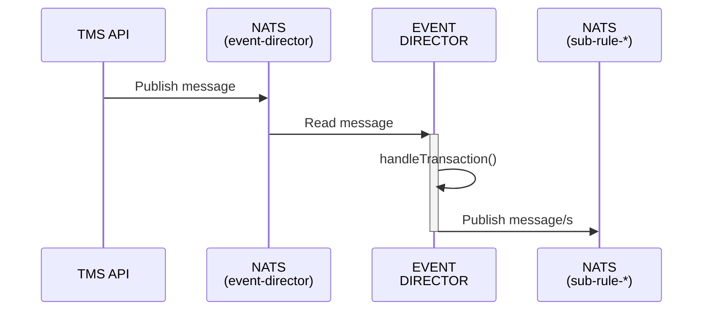
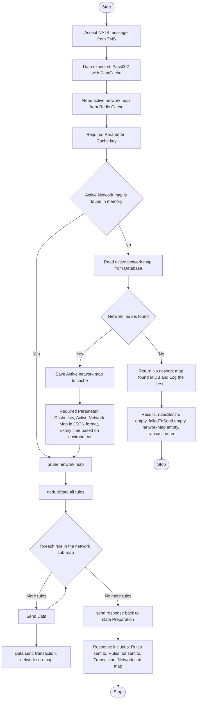

<!-- SPDX-License-Identifier: Apache-2.0 -->

# Event Director (ED)

<div align="center">

</div>

## Overview
This application fetches an active network map either from cache or from a database, filters it for relevant messages, deduplicates rules, and dispatches them for processing

### Services

- [PostgreSQL](https://www.postgresql.org//): Database Management
- [NATS](https://nats.io): Message queue

You also need NodeJS to be installed in your system. The current [LTS](https://nodejs.org/en) should be suitable. Please open an issue if the application fails to build on the current LTS version. Unix platforms, you should be able to find `nodejs` in your package manager's repositories.

#### Setting Up

```sh
git clone https://github.com/tazama-lf/event-director
cd event-director
```
You then need to configure your environment: a [sample](.env.template) configuration file has been provided and you may adapt that to your environment. Copy it to `.env` and modify as needed:

```sh
cp .env.template .env
```
A [registry](https://github.com/tazama-lf/docs/blob/f292c9ddabf52d6fe62addc1c61957419ed4ad05/Technical/processor-startup-config-registry.md) of environment variables is provided to provide more context for what each variable is used for.

##### Additional Variables

| Variable                           | Purpose                         | Example                    |
|------------------------------------|---------------------------------|----------------------------|
| `CONFIGURATION_DATABASE`           | PostgreSQL database name        | `configuration`            |
| `CONFIGURATION_DATABASE_HOST`      | PostgreSQL hostname or endpoint | `localhost`                |
| `CONFIGURATION_DATABASE_PORT`      | PostgreSQL post used            | `5432`                     |
| `CONFIGURATION_DATABASE_USER`      | PostgreSQL username             | `root`                     |
| `CONFIGURATION_DATABASE_PASSWORD`  | PostgreSQL database password    | `password`                 |
| `CONFIGURATION_DATABASE_CERT_PATH` | PostgreSQL certificate path     | `/path/to/certificate.crt` |

#### Build and Start

```sh
npm i
npm run build
npm run start
```

## Inputs

```js
const transactionRequest = {
  metaData: { traceParent: "00-4bf92f3577b34da6a3ce929d0e0e4736-00f067aa0ba902b7-01" }, // https://www.w3.org/TR/trace-context/#examples-of-http-traceparent-headers
  transaction: { TxTp: "pacs.002.001.12", "FIToFIPmtSts": { /* Pacs002 */ } },
  DataCache: { /* cached data relevant to the transaction */ }
};
```
A Pacs002 message is expected as an input as defined [here](https://github.com/tazama-lf/frms-coe-lib/blob/dev/src/interfaces/Pacs.002.001.12.ts)

## Internal Process Flow

### Sequence Diagram



### Activity Diagram



## Outputs
The output is the input with an added [NetworkMap](https://github.com/tazama-lf/frms-coe-lib/blob/dev/src/interfaces/NetworkMap.ts):

```js
{
  metaData: { traceParent: "00-4bf92f3577b34da6a3ce929d0e0e4736-00f067aa0ba902b7-01" }, // https://www.w3.org/TR/trace-context/#examples-of-http-traceparent-headers
  transaction: { TxTp: "pacs.002.001.12", "FIToFIPmtSts": { /* Pacs002 */ } },
  networkMap: { /* Network Map */ },
  DataCache: { /* cached data relevant to the transaction */ }
};
```


## Troubleshooting
#### npm install
Ensure generated token has read package rights

#### npm build
Ensure that you're on the current LTS version of Node.JS

### Runtime issues
#### Network Map changes are not reflected on the application
For changes in the network map, you will have to restart the application
