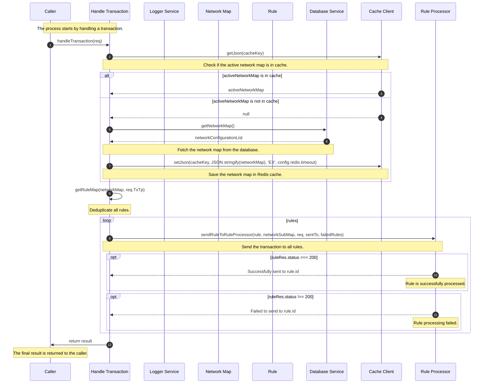

# CRSP

## Overview

Here's a brief explanation of each participant:

1. Caller: The caller initiates the request to process a transaction.
2. Handle Transaction: This function handles the transaction, coordinates the processing steps, and accumulates the results.
3. Logger Service: This service logs various events, errors, and information during the process.
4. Network Map: A map of the transaction network, containing information about messages, channels, typologies, and rules.
5. Rule: A specific rule from the network map that needs to be applied to the transaction.
6. Database Service: This service is responsible for fetching the network map from the database.
7. Cache Client: This Redis cache client stores and retrieves the active network map for faster processing.
8. Rule Processor: This processor applies the rule to the transaction and returns the result.

## Sequence Diagram

Here's a detailed explanation of the numbers in the sequence diagram:

1. The process starts with the caller initiating a request to handle a transaction.
2. Handle Transaction checks if the active network map is in the cache.
3. If the active network map is not in cache, Handle Transaction fetches the network map from the database.
4. The network map is saved in Redis cache for faster processing.
5. Handle Transaction deduplicates all rules in the network map.
6. The transaction is sent to all rules for processing.
7. The Rule Processor returns the result, indicating if the rule was processed successfully or if there was a failure.
8. Handle Transaction returns the final result to the caller.
